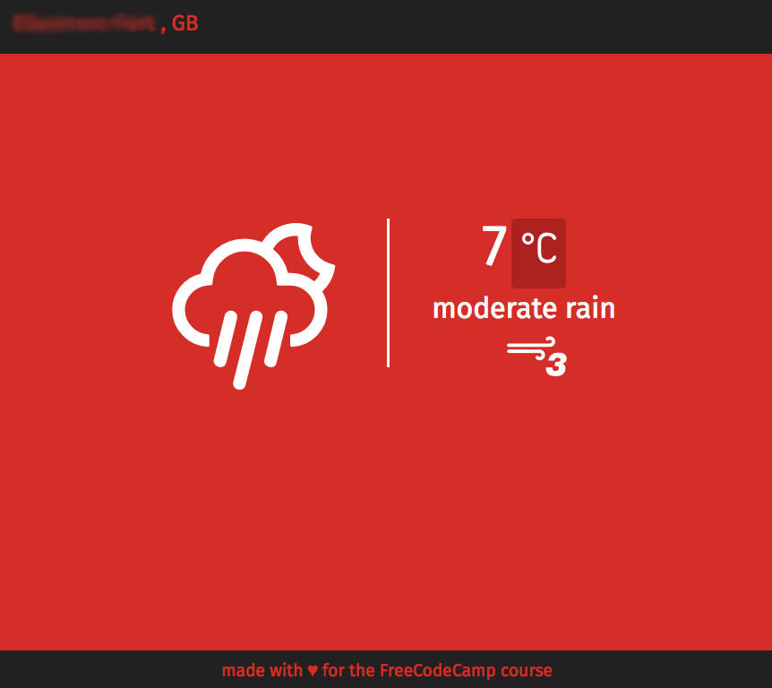
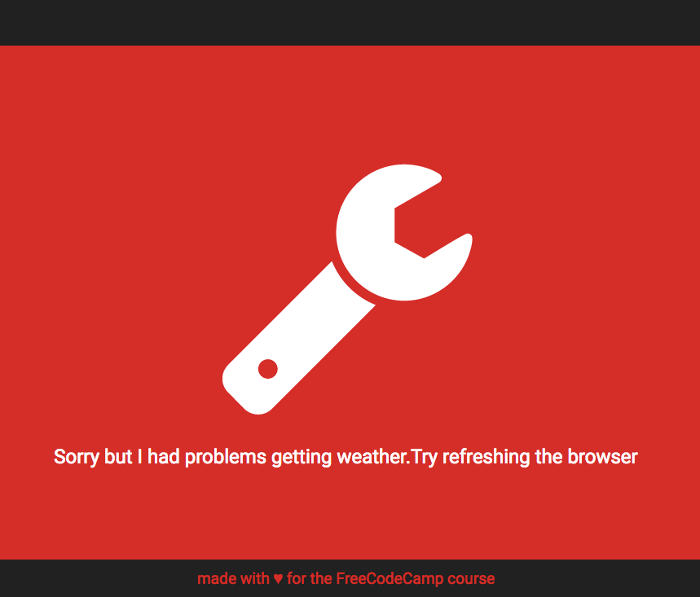

# WeatherAppv2  using freegoip
A weather app that uses Freegoip for geolocation, OpenWeatherMap api and Eric Flowers's weather icons. Also employs SaSS and nested callbacks

This weather app is also on [Codepen](https://codepen.io/tom_o/pen/WpqRPN)

##### Unfortunatly due to CORS (Cross-Origin Resource Sharing) restrictions Codepen dosnt allow the OpenWeatherMap API to work directly on the Codepen site. I have tried a number of work arounds including using [https://crossorigin.me/](https://crossorigin.me/) and [cors anywhere](https://cors-anywhere.herokuapp.com/) but they failed to function.

An alternative could be to use another weather API such as the [APIXU](https://www.apixu.com/api.aspx) weather app **but I recomend downloading the app from Codepen or Github** and running it from your own browser localy. 

It was designed as part of the the [Free Code Camp course](https://www.freecodecamp.com/challenges/show-the-local-weather)

The [previous version uses HTML5 geolocation](https://github.com/appijumbo/weatherAppv1)

## Objectives

Build a CodePen.io app that is functionally similar to this: http://codepen.io/FreeCodeCamp/full/bELRjV.

User Story

  * see the weather in my current location.

  * see a different icon or background image (e.g. snowy mountain, hot desert) depending on the weather.

  * push a button to toggle between Fahrenheit and Celsius.

Should any geolocation problems arrise the console logs a specific error. However for the user this isn't helpful, thus an error like this will be output

